# Quizly

[](https://www.ruby-lang.org)
[](https://rubyonrails.org)
[](https://github.com/pezhmanmoloudi/quizly/actions/workflows/ci.yml)
[](LICENSE)

A flashcard learning platform built with Rails 8. Create decks, add cards, and study with five distinct modes — from simple card flipping to adaptive quizzes and spaced repetition.

<p align="center">
  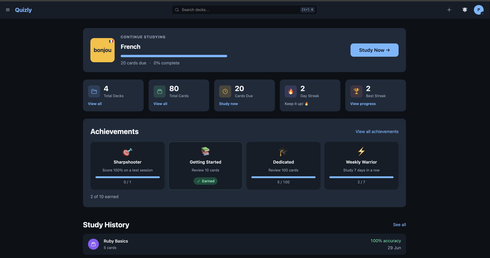
</p>

<p align="center"><em>A personalized dashboard tracks streaks, due cards, achievements, and study history at a glance.</em></p>

---

## Study Modes

| Mode | Description |
|------|-------------|
| **Flashcard** | Browse and flip cards at your own pace |
| **Study** | Spaced repetition using the SM-2 algorithm — due cards are served based on your performance history |
| **Learn** | Progressive mastery — incorrectly answered cards are re-queued until you get them right |
| **Test** | Adaptive quiz with multiple choice, written answer, and true/false question types |
| **Match** | Pair-matching game using 8 randomly selected cards from the deck |

---

## Screenshots

A quick tour of Quizly — a polished, dark-first interface that scales cleanly from desktop to mobile.

### Highlights

<table>
  <tr>
    <td width="50%">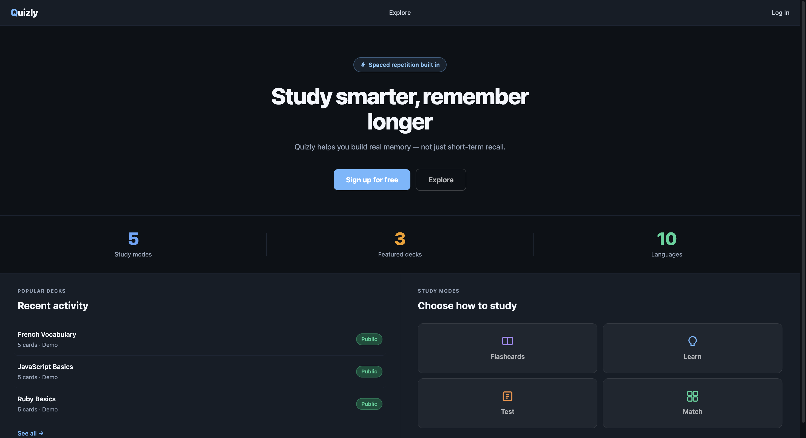<br><sub><b>Landing page</b> — study-mode overview and a clear path to sign up.</sub></td>
    <td width="50%">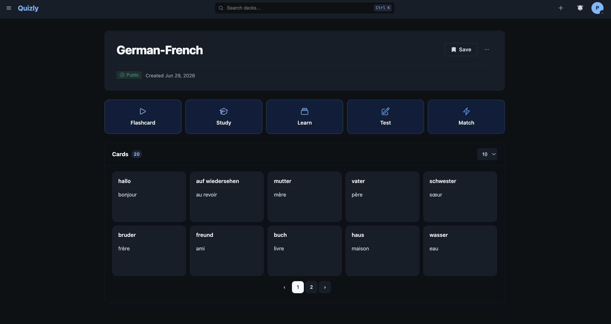<br><sub><b>Deck page</b> — launch any of the five study modes over a paginated card list.</sub></td>
  </tr>
  <tr>
    <td>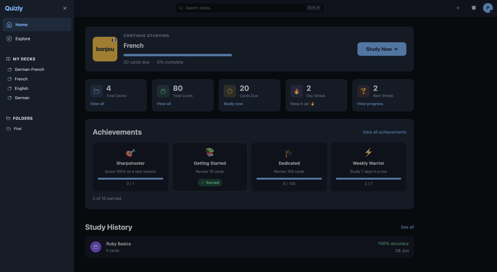<br><sub><b>Navigation</b> — slide-out sidebar for Home, Explore, My Decks, and Folders.</sub></td>
    <td align="center">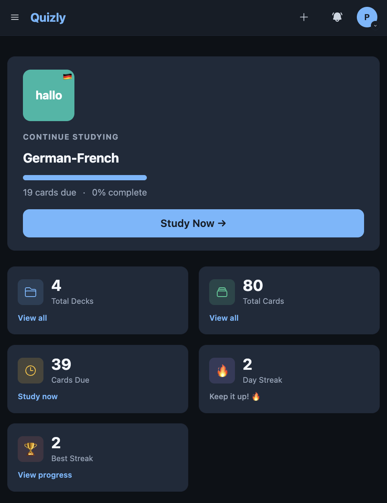<br><sub><b>Responsive</b> — the same experience, fully adapted for mobile.</sub></td>
  </tr>
</table>

### Study modes

| | |
|---|---|
| 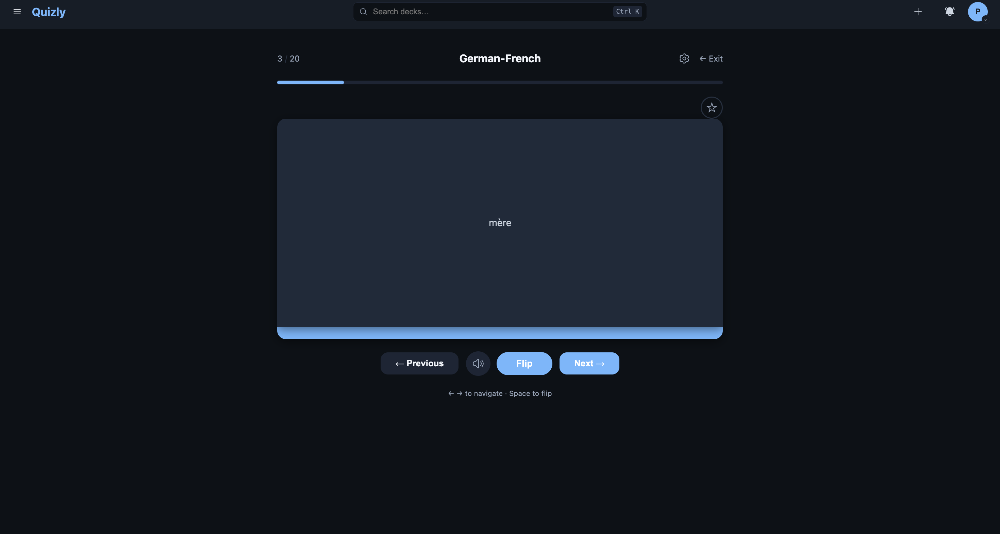 | 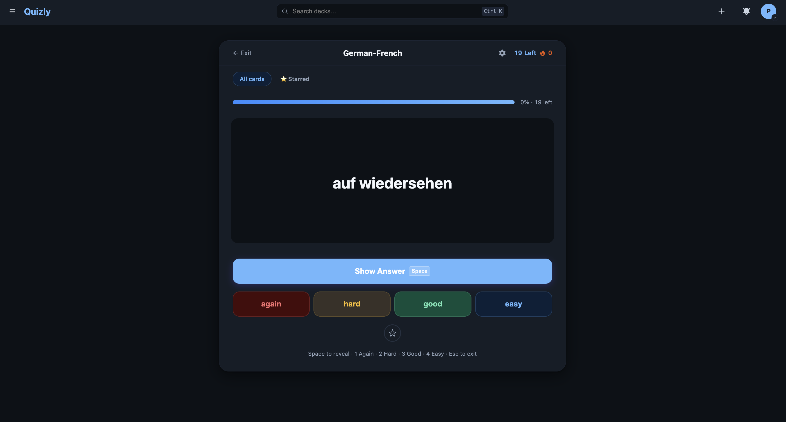 |
| **Flashcard** — flip cards with keyboard navigation, audio, and starring. | **Study** — SM-2 spaced repetition with Again / Hard / Good / Easy grading. |
| 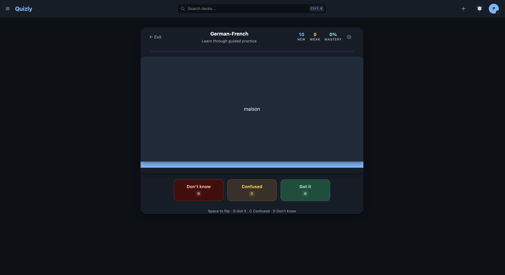 | 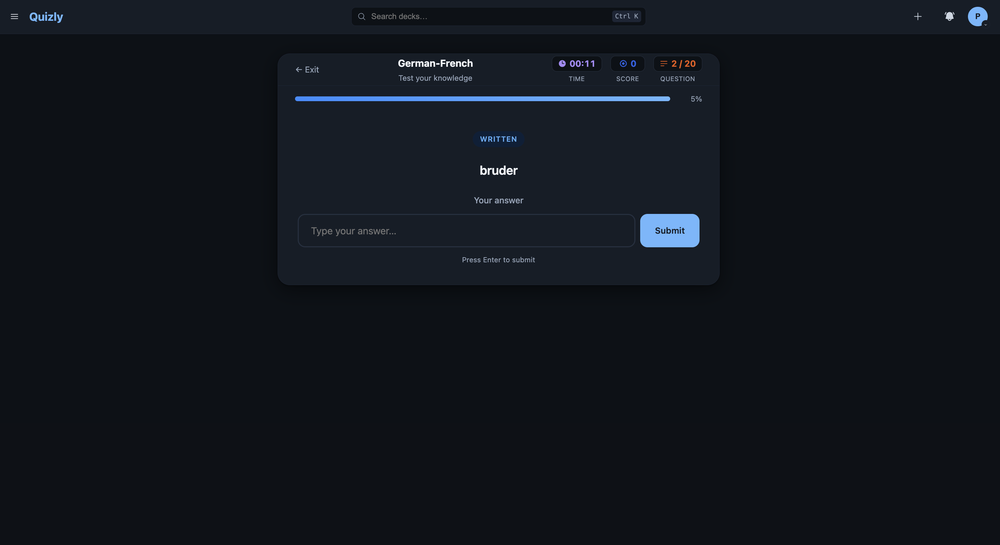 |
| **Learn** — guided mastery loop that re-queues cards you haven't nailed. | **Test** — timed quizzes mixing written, multiple-choice, and true/false. |
| 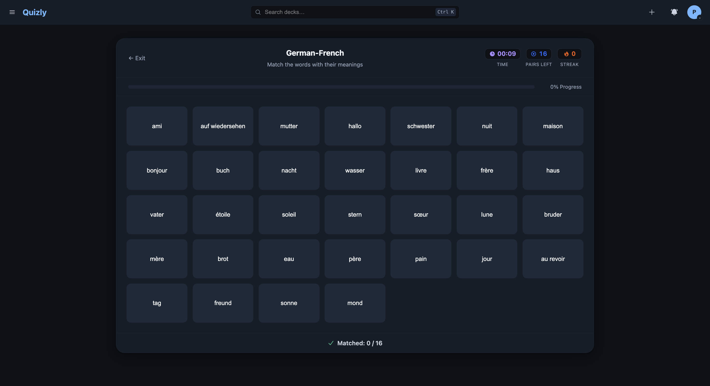 | |
| **Match** — fast-paced pairing game with a live timer and streak counter. | |

### Organize &amp; manage

| | |
|---|---|
| 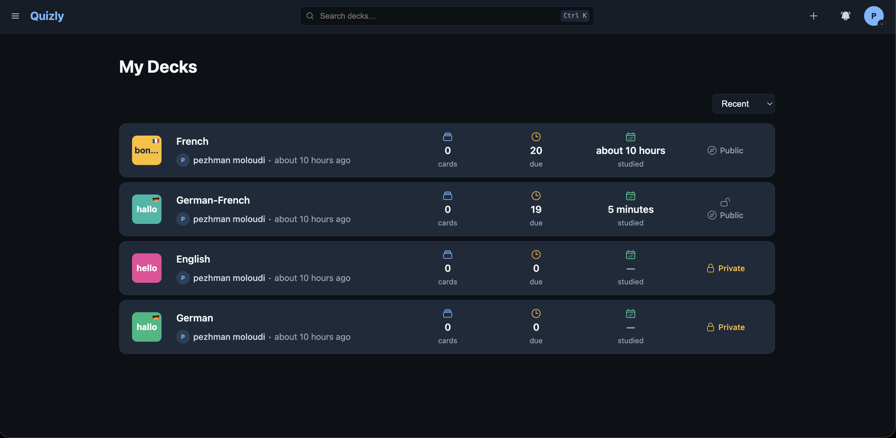 | 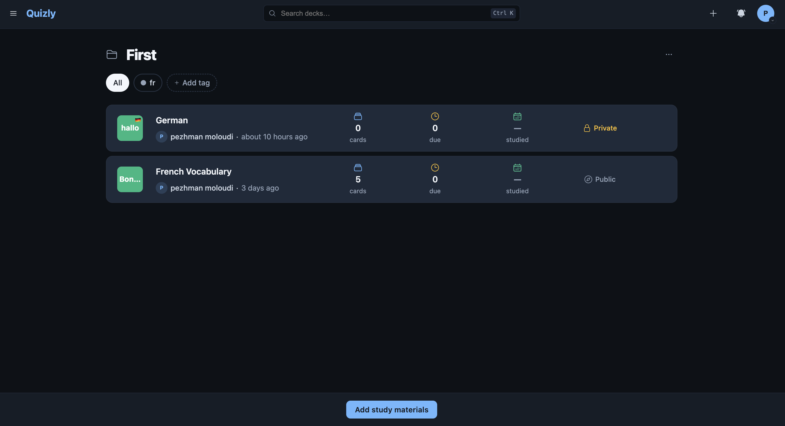 |
| **My Decks** — every deck with card counts, due totals, and visibility. | **Folders** — group decks and filter them with colored, deck-scoped tags. |
|  | 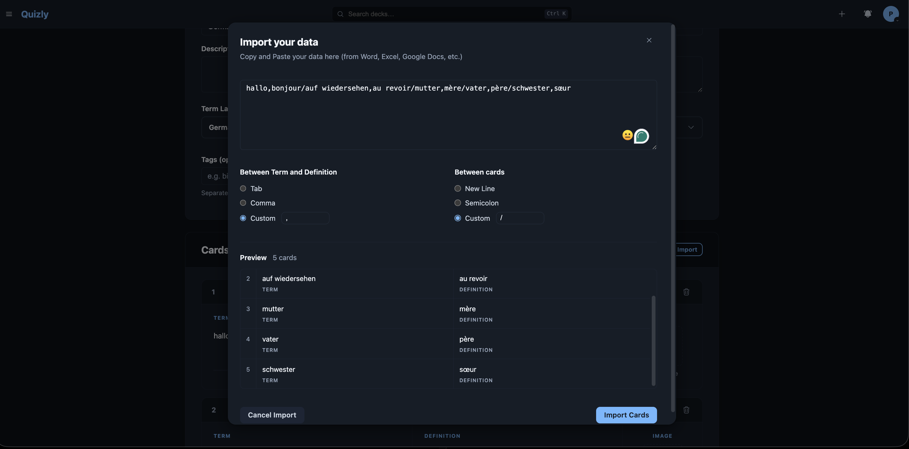 |
| **Add study materials** — drop existing decks into a folder in one step. | **Import** — bulk-create cards by pasting text with custom separators. |

### Account &amp; personalization

| | |
|---|---|
| 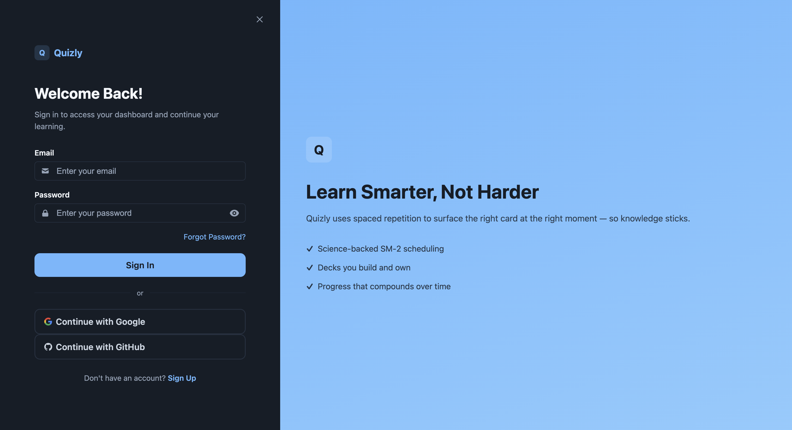 | 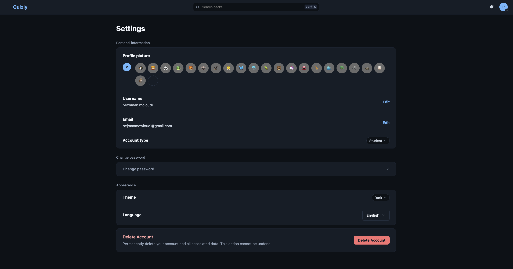 |
| **Sign in** — email & password alongside Google and GitHub OAuth. | **Settings** — avatar, account details, theme, language, and account deletion. |
| 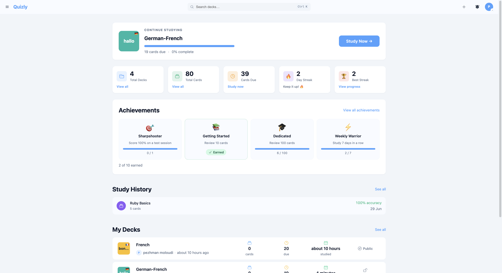 | 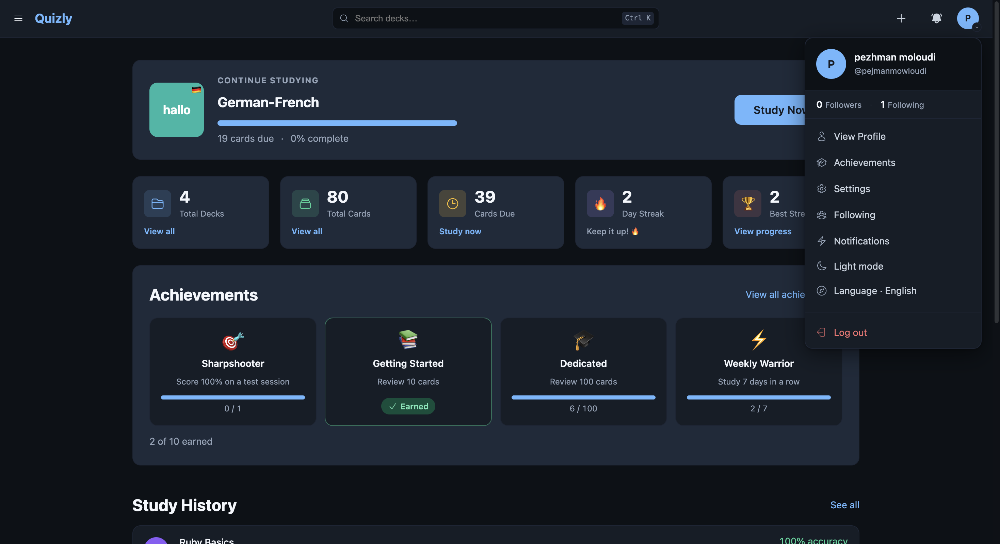 |
| **Light theme** — full light/dark theming across the app. | **Profile menu** — quick access to profile, achievements, and preferences. |

---

## Tech Stack

| Layer | Technology |
|-------|------------|
| Language | Ruby 3.3.5 |
| Framework | Rails 8.1.3 |
| Database (local) | SQLite3 |
| Database (Docker) | PostgreSQL 16 |
| Frontend | Hotwire (Turbo + Stimulus) |
| Asset pipeline | Propshaft + Importmap — no Node.js required |
| Authentication | bcrypt (`has_secure_password`) |
| File uploads | Active Storage |
| Pagination | Pagy |
| Background jobs | Solid Queue (default) |
| Caching | Solid Cache |
| Action Cable | Solid Cable |
| Testing | RSpec 8 + FactoryBot + Faker |
| Linting | Rubocop (rails-omakase) |
| Security scanning | Brakeman |
| CI | GitHub Actions |
| Deployment | Kamal + Docker |

---

## Features

- Email & password authentication plus OAuth sign-in with Google and GitHub
- User registration, logout, and password reset via email token
- User profile with display name and avatar upload (JPG/PNG/WEBP, 5 MB max)
- Deck creation, editing, and deletion with public/private visibility
- Flashcard management with position ordering
- Five study modes: Flashcard, Study, Learn, Test, Match
- Spaced repetition tracking per user per card (SM-2 algorithm)
- Starred cards and starred-only study filter
- Study session history with accuracy metrics
- Folders to organize decks, with colored deck-scoped tags and filtering
- Explore page to discover public decks, searchable and sortable by popularity
- Shared decks — copy any public deck into your own library
- Bulk card import via CSV (auto-detect columns) or tab-delimited text
- In-app notifications and a configurable profile menu
- Multi-language interface and light/dark themes
- Rate-limited login (10 attempts per 3 minutes)

---

## Prerequisites

**Docker path (recommended)**
- Docker Desktop 4.x or Docker Engine 24+ with Compose v2
- `config/master.key` — ask a teammate or retrieve from your secrets manager

**Local path (without Docker)**
- Ruby 3.3.5 — install via [rbenv](https://github.com/rbenv/rbenv), [rvm](https://rvm.io), or [asdf](https://asdf-vm.com)
- SQLite3 and libvips system libraries (see Local Setup below)
- `config/master.key` — same as above

---

## Quick Start — Docker

```bash
git clone <repo-url>
cd quizly

# Create your local environment file
cp .env.example .env
# Open .env and set RAILS_MASTER_KEY to the value from config/master.key

# Build and start all services
docker compose up --build
```

The app is available at **http://localhost:3001**

```bash
# Load demo data (first time only)
docker compose exec web bin/rails db:seed
```

**Demo account**

| Field | Value |
|-------|-------|
| Email | `demo@quizly.test` |
| Password | `password123` |

Three sample decks (Ruby Basics, JavaScript Basics, French Vocabulary) are included.

See [DOCKER.md](DOCKER.md) for the full Docker reference including daily workflow, full reset, and troubleshooting.

---

## Local Development Setup

Use this path if you prefer to run Rails directly without Docker. The app uses SQLite3 locally — no PostgreSQL or Redis required.

**1. Install system dependencies**

```bash
# macOS
brew install sqlite3 vips

# Ubuntu / Debian
sudo apt install libsqlite3-dev libvips-dev
```

**2. Install Ruby 3.3.5**

```bash
# rbenv
rbenv install 3.3.5
rbenv local 3.3.5

# rvm
rvm install 3.3.5

# asdf
asdf install ruby 3.3.5
asdf local ruby 3.3.5
```

**3. Install gems**

```bash
bundle install
```

**4. Configure environment**

```bash
cp .env.example .env
# Open .env and set RAILS_MASTER_KEY to the value from config/master.key
```

**5. Set up the database**

```bash
bin/rails db:create db:migrate db:seed
```

**6. Start the server**

```bash
bin/rails server
```

The app is available at **http://localhost:3000**

Log in with `demo@quizly.test` / `password123`.

---

## Running Tests

```bash
# Full test suite
bundle exec rspec

# By layer
bundle exec rspec spec/models
bundle exec rspec spec/requests
bundle exec rspec spec/services

# Code style
bin/rubocop

# Security scan
bin/brakeman --no-pager
```

**CI pipeline** — GitHub Actions runs four checks automatically on every PR and push to `main`:

| Check | Command |
|-------|---------|
| Security scan | `bin/brakeman --no-pager` |
| JS dependency audit | `bin/importmap audit` |
| Style lint | `bin/rubocop -f github` |
| Test suite | `bundle exec rspec` |

---

## Roadmap

- AI-generated question types in Test mode (using the Claude API)
- Cloud storage (S3 / R2) for production Active Storage uploads
- Public REST API for deck import/export
- Deck collaboration — multiple editors per deck
- Mobile-responsive Match mode

---

## Contributing

See [docs/CONTRIBUTING.md](docs/CONTRIBUTING.md) for the PR workflow, code conventions, and test patterns.

---

## License

This project is licensed under the MIT License — see [LICENSE](LICENSE) for details.

---

## Further Reading

| Document | Contents |
|----------|----------|
| [DOCKER.md](DOCKER.md) | Full Docker workflow, daily commands, architecture notes |
| [docs/ARCHITECTURE.md](docs/ARCHITECTURE.md) | Data model, study mode internals, services, Stimulus controllers |
| [docs/DEPLOYMENT.md](docs/DEPLOYMENT.md) | Kamal deployment guide, production environment variables |
| [docs/CONTRIBUTING.md](docs/CONTRIBUTING.md) | PR workflow, code conventions, test patterns |
